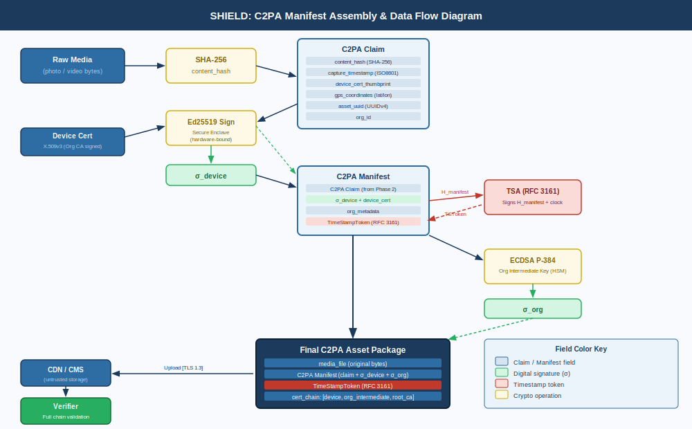
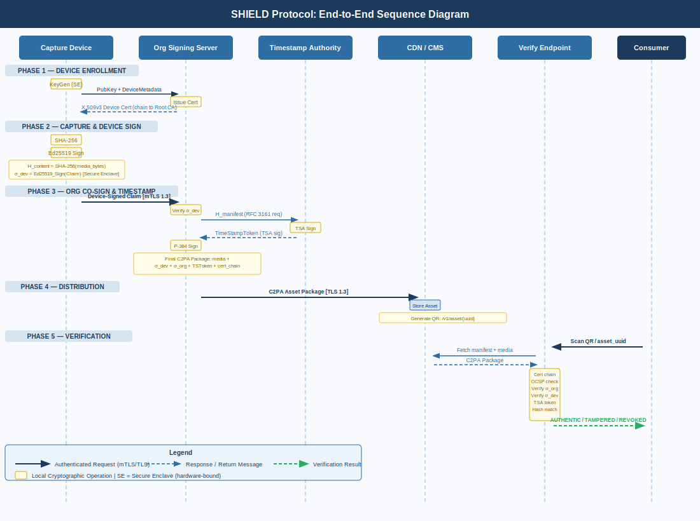

# SHIELD: Signed Hash Infrastructure for Evidence-Linked Digital Content
### Scenario 10: Media Provenance & Deepfake Defense
#CS-GY 6903: Applied Cryptography - NYU Tandon School of Engineering#
**Cryptographic Systems Design Report**

> *Rosie Domenech | GitHub: [RosieDomenech](https://github.com/RosieDomenech)*

---



---


_Figure 1: C2PA Manifest Assembly & Data Flow Diagram_

---

## Table of Contents

1. [System Overview](#1-system-overview)
2. [Trust Assumptions](#2-trust-assumptions)
3. [Threat Model](#3-threat-model)
4. [Step-by-Step Protocol Workflow](#4-step-by-step-protocol-workflow)
5. [Cryptographic Justification](#5-cryptographic-justification)
6. [Attack Mitigations Summary](#6-attack-mitigations-summary)
7. [References](#7-references)

---

## 1. System Overview

### 1.1 Problem Statement

The proliferation of AI-generated synthetic media - commonly called "deepfakes" - presents an existential threat to the epistemic integrity of digital journalism. Modern generative models can convincingly fabricate facial expressions, voices, and entire scenes, making it impossible for a human observer to distinguish authentic footage from fabricated content by inspection alone. News organizations require a cryptographically verifiable chain of custody, established at the precise moment of capture, that travels with the media asset through its entire lifecycle: from the journalist's camera to the publisher's server to the end consumer's browser.

SHIELD addresses this problem by combining device-level hardware-backed digital signatures, a hierarchical Public Key Infrastructure (PKI), a C2PA-compatible content manifest, and a trusted timestamping service to produce a tamper-evident, publicly verifiable provenance record for every piece of digital media captured by participating organizations.

### 1.2 System Architecture

The SHIELD system consists of five principal components:

```
┌─────────────────────────────────────────────────────────────────────────┐
│                         SHIELD SYSTEM OVERVIEW                          │
│                                                                         │
│  ┌──────────────┐     ┌──────────────┐     ┌────────────────────────┐  │
│  │  CAPTURE     │     │  ORG SIGNING │     │   PKI / CA             │  │
│  │  DEVICE      │────▶│  SERVER      │────▶│   INFRASTRUCTURE       │  │
│  │  (Camera /   │     │  (TLS 1.3)   │     │   (Root CA + Org CA)   │  │
│  │   Phone)     │     │              │     │                        │  │
│  └──────────────┘     └──────────────┘     └────────────────────────┘  │
│         │                    │                         │                │
│         │                    ▼                         │                │
│         │          ┌──────────────────┐                │                │
│         │          │  TRUSTED         │                │                │
│         │          │  TIMESTAMP AUTH  │◀───────────────┘                │
│         │          │  (RFC 3161)      │                                 │
│         │          └──────────────────┘                                 │
│         │                    │                                          │
│         ▼                    ▼                                          │
│  ┌──────────────────────────────────────────────────────────────────┐   │
│  │              CONTENT DELIVERY & DISTRIBUTION LAYER               │   │
│  │         (CDN / CMS - stores media + C2PA manifest)               │   │
│  └──────────────────────────────────────────────────────────────────┘   │
│                               │                                         │
│                               ▼                                         │
│                   ┌───────────────────────┐                             │
│                   │   VERIFICATION        │                             │
│                   │   ENDPOINT            │                             │
│                   │   (Public API / QR)   │                             │
│                   └───────────────────────┘                             │
└─────────────────────────────────────────────────────────────────────────┘
```

**Component Roles:**

| Component | Role |
|---|---|
| Capture Device | Generates content hash and device-level signature using Secure Enclave |
| Org Signing Server | Co-signs the manifest with the organization's intermediate CA key |
| PKI / CA Infrastructure | Issues, revokes, and verifies the certificate chain for all participants |
| Trusted Timestamp Authority (TSA) | Provides an RFC 3161-compliant timestamp token binding the hash to a specific clock |
| Content Delivery Layer | Stores the media file and its attached C2PA manifest |
| Verification Endpoint | Public API consumed by browsers, fact-checkers, or QR code scanners |

### 1.3 C2PA Manifest Data Flow


*Figure 1: C2PA Manifest Assembly & Data Flow - from capture through org co-signing to the final tamper-evident asset package*

---

## 2. Trust Assumptions

A well-scoped trust model explicitly defines what the system relies upon and where its guarantees end.

**Trusted:**
- The Root CA and Organizational Intermediate CAs are operated honestly and their private keys are stored in Hardware Security Modules (HSMs).
- The Secure Enclave (Apple SEP / Android StrongBox) on capture devices correctly isolates private key material and cannot be extracted without physical tampering that is detectable.
- The RFC 3161 Timestamp Authority is operated by an independent trusted third party (e.g., DigiCert, Sectigo) and its clock is accurate and unforgeable.
- TLS 1.3 correctly protects communications between all components.

**Not Trusted:**
- The network (assumed hostile - all communications treated as potentially intercepted or modified).
- The cloud CDN or CMS layer (treated as an untrusted storage medium - integrity is verified cryptographically, not assumed).
- The end consumer's device (the verifier is stateless and cryptographic, requiring no trust in the client).
- Any intermediary between the camera and the signing server.

**Explicitly Out of Scope:**
- Physical coercion of a journalist to fabricate a scene before capture.
- Compromise of the Root CA private key (a systemic failure requiring certificate revocation and ecosystem rebuild - this is an assumption all PKI systems make).

---

## 3. Threat Model

### 3.1 Adversary Profile

The primary adversary is a sophisticated, motivated attacker - such as a state-sponsored disinformation actor - who wishes to either inject fabricated media that appears authentic, or discredit genuine authentic media by making verifiable provenance appear to fail. Secondary adversaries include opportunistic tamperers and insider threats at the news organization.

### 3.2 Attack Vectors and Mitigations

#### 3.2.1 Data Eavesdropping (Passive Interception)

**Attack:** An attacker positioned on the network between the capture device and the org signing server intercepts the raw media file in transit, gaining access to unpublished footage.

**Mitigation:** All communications between system components are wrapped in TLS 1.3 with certificate pinning. The device only connects to a signing server whose leaf certificate chains to the organization's pinned intermediate CA. Passive eavesdropping yields only ciphertext encrypted under ephemeral session keys derived via X25519 key agreement - computationally infeasible to decrypt.

---

#### 3.2.2 Data Modification / Tampering (Active Integrity Attack)

**Attack:** An attacker modifies the media file in transit or at rest (e.g., on the CDN), replacing frames with deepfake content. The attacker also attempts to update the stored manifest to match.

**Mitigation:** The C2PA manifest contains a SHA-256 cryptographic hash of the original media content, signed by the device's private key. Any modification to the media file produces a hash that does not match the signed value in the manifest. Because the manifest itself is signed, an attacker cannot forge a valid manifest without possession of the device's private key, which is hardware-bound and non-exportable. The org co-signature provides a second layer: even if a device key were somehow compromised, an attacker would additionally need the organizational intermediate CA key.

---

#### 3.2.3 Originator Spoofing (Identity Forgery)

**Attack:** An attacker fabricates a media file and constructs a fake manifest claiming it was captured by a legitimate journalist's device, using a self-signed or fraudulently obtained certificate.

**Mitigation:** The device certificate is issued by the organization's intermediate CA, which itself chains to the Root CA. Verifiers perform a complete chain-of-trust validation. A self-signed certificate fails the chain validation at the root anchor. Certificate issuance requires organizational enrollment and physical provisioning of the device's key pair, with the public key certified at enrollment time. Certificate transparency logs (RFC 9162) allow public audit of all issued certificates, making fraudulent issuance detectable.

---

#### 3.2.4 Replay Attacks

**Attack:** An attacker captures a previously valid, signed media package and re-publishes it in a new context (e.g., replaying footage from one incident and claiming it depicts a different event today).

**Mitigation:** The RFC 3161 trusted timestamp token is embedded in the manifest and cryptographically binds the content hash to a specific point in time. The timestamp token is itself signed by the TSA's private key. A verifier can confirm that the media was signed at a specific date and time - context manipulation is detectable by the discrepancy between the embedded timestamp and the claimed publication date. Additionally, the manifest includes the geographic coordinates (GPS EXIF data) of capture when available, further anchoring provenance.

---

#### 3.2.5 Relay Attacks

**Attack:** An attacker intercepts a valid signing request mid-flight and relays it to the signing server through a different connection, attempting to inject attacker-controlled context data into the signed manifest.

**Mitigation:** The device-level signature is computed locally, within the Secure Enclave, before any network communication occurs. The org signing server receives the complete manifest payload (including the pre-computed device signature and content hash) over a mutually authenticated TLS 1.3 connection. Mutual TLS (mTLS) ensures both the device and the server authenticate each other with certificates, preventing a relay that cannot present a valid device certificate. The server signs only the payload it receives; an injected relay cannot alter the pre-signed device portion.

---

#### 3.2.6 Meet-in-the-Middle Attack

**Attack:** Against the content hash function, an attacker attempts to find two different media files that produce the same hash value, allowing a fabricated file to pass hash verification.

**Mitigation:** The system uses SHA-256 (256-bit output), providing a collision resistance of 2^128 operations - well beyond the computational reach of any known classical or near-term quantum adversary. The hash is also bound to the signature, meaning a collision is useless unless the attacker can also forge the signature, which requires breaking Ed25519 - a separate and independent hardness assumption. Upgrading to SHA-3-256 is planned as a defense-in-depth measure given its different internal construction (Keccak sponge vs. SHA-2 Merkle-Damgård).

---

#### 3.2.7 Man-in-the-Middle (MitM) Attack

**Attack:** An attacker interposes themselves between the device and the org server, presenting a fraudulent TLS certificate to the device while establishing a separate TLS connection to the server, decrypting and re-encrypting traffic in both directions.

**Mitigation:** The capture device application implements TLS certificate pinning. The device's trust store contains only the organization's intermediate CA certificate (not the system root store), meaning any certificate that does not chain to the pinned CA is immediately rejected, and the connection fails. The attacker cannot forge a certificate that satisfies this constraint without compromising the intermediate CA's private key (which is held in an HSM). Additionally, the device-level signature is computed before transmission, so even a successful MitM that decrypts the transport layer cannot alter the already-signed content.

---

#### 3.2.8 Deepfake Substitution Post-Capture

**Attack:** A sophisticated attacker does not tamper with the signed manifest but generates a deepfake that, when run through the SHA-256 hash function, produces the same hash as the original (a collision attack) - or they attempt to strip the manifest from the file and re-attach it to a fabricated file.

**Mitigation:** The manifest binds hash to file through a signature, not just a hash comparison. Stripping and re-attaching the manifest to a different file produces a hash mismatch detectable at verification. True SHA-256 collision attacks are computationally infeasible at 2^128 complexity. For the specific case of AI-generated substitution, the system supplements cryptographic verification with C2PA's "active manifest" model, where editing tools that support C2PA append modification assertions to the manifest - the absence of a capture-origin assertion in a modified file is itself a verifiable signal.

---

#### 3.2.9 Key Revocation Failures (Insider Threat / Compromise)

**Attack:** A journalist's device is stolen or their signing key is compromised. An attacker uses the key to sign fabricated content.

**Mitigation:** The SHIELD system integrates OCSP stapling on the verification endpoint. Each verification query checks the device certificate against the organization's OCSP responder in real time. Revoked certificates cause verification to fail immediately, even if the signature is cryptographically valid. The organization's security team can revoke a device certificate within minutes of detecting compromise. CRL distribution points are also embedded in all certificates as a fallback.

---


_Figure 2: SHIELD End-to-End Sequence Diagram_

## 4. Step-by-Step Protocol Workflow

### Phase 1: Device Enrollment (One-Time)

```
1. Journalist device generates an Ed25519 key pair inside the Secure Enclave.
   Private key: non-exportable, hardware-bound.
   Public key: exported for certification.

2. Public key + device metadata (serial, org ID) sent to Org CA via authenticated enrollment portal.

3. Org CA issues an X.509v3 device certificate signed by the Org Intermediate CA.
   Certificate includes: Subject (device ID + journalist ID), Validity Period (1 year), Key Usage (digitalSignature), Extended Key Usage (id-kp-contentSigning), OCSP URL, CRL DP.

4. Certificate installed on device. Private key remains in Secure Enclave.
```

### Phase 2: Content Capture and Device Signing

```
1. Journalist captures media (photo/video) via the SHIELD-integrated camera app.

2. App computes SHA-256 hash of the raw media bytes immediately upon capture.
   H_content = SHA-256(raw_media_bytes)

3. App assembles a C2PA Claim structure:
   {
     "content_hash": H_content,
     "hash_algorithm": "SHA-256",
     "capture_timestamp_local": ISO8601_datetime,
     "device_cert_thumbprint": SHA-256(device_cert),
     "gps_coordinates": { "lat": ..., "lon": ... },  // if available
     "org_id": "NYT-SHIELD-001",
     "asset_uuid": UUIDv4()
   }

4. App sends the Claim to the Secure Enclave.
   Secure Enclave computes: σ_device = Ed25519_Sign(device_private_key, SHA-256(Claim_bytes))

5. App packages: Claim + σ_device + device_certificate → "Device-Signed Claim"
```

### Phase 3: Organizational Co-Signing and Timestamping

```
6. Device transmits the Device-Signed Claim to the Org Signing Server over mTLS 1.3.
   Server verifies device certificate chain → Root CA.
   Server verifies σ_device over the Claim.

7. Org Signing Server constructs the C2PA Manifest:
   Manifest = { Device-Signed Claim + org_metadata + publication_intent }

8. Signing Server submits H_manifest = SHA-256(Manifest_bytes) to the RFC 3161 TSA.
   TSA returns: TimeStampToken = TSA_Sign(H_manifest + TSA_timestamp)

9. Signing Server signs the complete manifest + timestamp token:
   σ_org = ECDSA_P384_Sign(org_intermediate_key, SHA-256(Manifest + TimeStampToken))

10. Final C2PA Asset Package assembled:
    {
      "media_file": <original_bytes>,
      "manifest": {
        "claim": { ...fields... },
        "device_signature": σ_device,
        "device_cert": <PEM>,
        "org_signature": σ_org,
        "org_cert_chain": [org_intermediate, root_ca],
        "timestamp_token": TimeStampToken
      }
    }
```

### Phase 4: Distribution

```
11. Asset Package uploaded to CDN/CMS.
    The media file and its manifest are stored as a linked pair (manifest embedded as XMP sidecar or asset header per C2PA spec).

12. A verification QR code is generated:
    QR → https://verify.shield.org/v1/asset/{asset_uuid}
    QR may also encode a compact hash of the manifest for offline partial verification.
```

### Phase 5: End-Consumer Verification

```
13. Consumer scans QR code or activates browser extension.

14. Verification Endpoint performs:
    a. Retrieve asset manifest by UUID.
    b. Validate org certificate chain → Root CA.
    c. Check org certificate OCSP status (not revoked).
    d. Verify σ_org over (Manifest + TimeStampToken).
    e. Validate device certificate chain → Org CA → Root CA.
    f. Check device certificate OCSP status (not revoked).
    g. Verify σ_device over Claim.
    h. Verify TimeStampToken via TSA public key.
    i. Recompute SHA-256(media_bytes) and compare to H_content in Claim.

15. Verification result returned:
    ✅ AUTHENTIC - captured by [device ID] at [timestamp], signed by [org name]
    ❌ TAMPERED  - content hash mismatch detected
    ❌ REVOKED   - signing certificate revoked on [date]
    ❌ INVALID   - signature chain broken
```

---

### 4.6 Protocol Sequence Diagram


*Figure 2: End-to-End Protocol Sequence - from device enrollment through consumer verification. Solid arrows = requests, dashed = responses.*

---

## 5. Cryptographic Justification

### 5.1 Ed25519 for Device Signatures

Ed25519 (Edwards-curve Digital Signature Algorithm over Curve25519) is selected for device-level signing for three reasons. First, it produces compact 64-byte signatures with fast constant-time signing and verification operations - critical for low-latency capture workflows. Second, its security is grounded in the hardness of the discrete logarithm problem over a twisted Edwards curve with a cofactor of 8, providing approximately 128-bit security. Third, and critically for mobile deployment, Ed25519 is natively supported by the Apple Secure Enclave and Android StrongBox Keymaster, enabling true hardware-bound keys that are never exposed to application-layer code. Unlike RSA-2048 (whose 112-bit security is borderline adequate) or ECDSA with NIST P-256 (which requires careful nonce management to avoid catastrophic failures), Ed25519 is deterministic and immune to nonce reuse vulnerabilities.

### 5.2 ECDSA P-384 for Organizational Signatures

The organizational intermediate CA key uses ECDSA P-384, providing 192-bit security. The step up from Ed25519's 128-bit security is intentional: the org key is a higher-value, longer-lived credential that signs many assets, making it a more attractive target for cryptanalytic attack. The additional security margin is warranted. P-384 is FIPS 186-5 compliant, satisfying any federal contracting requirements a news organization may face. The key is stored in a FIPS 140-2 Level 3 validated HSM (e.g., Thales Luna Network HSM), ensuring it cannot be extracted even with physical access to the device.

### 5.3 SHA-256 Content Hashing

SHA-256 is used for all content hashing. Its 256-bit output provides 128-bit collision resistance under the birthday bound, requiring an adversary to evaluate the hash function approximately 2^128 times to find a collision - a figure that exceeds the estimated computational budget of any nation-state over any reasonable time horizon using classical hardware. SHA-256 is also hardware-accelerated on all modern mobile SoCs, adding negligible latency to the capture workflow. A future upgrade path to SHA-3-256 is explicitly noted in the system design, as SHA-3's Keccak sponge construction provides algorithmic diversity against any undiscovered structural weaknesses in the SHA-2 Merkle-Damgård design.

### 5.4 RFC 3161 Trusted Timestamps

A naive system that relies on the device's local clock for timestamps is vulnerable to clock manipulation - an attacker who compromises a device can backdate or forward-date content. RFC 3161 trusted timestamps solve this by having a mutually trusted third party (the TSA) cryptographically attest that a specific hash value existed at a specific time according to the TSA's authoritative clock. The TimeStampToken is a signed CMS object; its validity does not depend on the device or organization's clocks at all. This eliminates replay attacks that attempt to repurpose old, legitimately signed content in new contexts.

### 5.5 X.509 PKI and Certificate Transparency

The hierarchical PKI (Root CA → Org Intermediate CA → Device Certificate) establishes a chain of trust that is globally auditable. Certificate Transparency (RFC 9162) requires all issued certificates to be logged in append-only public logs (e.g., Google's Argon log). This prevents a compromised CA from issuing fraudulent certificates without the issuance being publicly detectable - any certificate appearing in a verification chain that is not present in the CT logs is treated as invalid. This closes the backdoor of CA-level compromise as an undetectable attack vector.

### 5.6 TLS 1.3 Transport Security

All inter-component communication uses TLS 1.3 with the X25519 key exchange, providing Perfect Forward Secrecy (PFS). PFS ensures that compromise of any long-term key does not retroactively expose past session traffic, defeating "harvest now, decrypt later" attacks where an adversary records encrypted traffic and stores it in anticipation of a future key compromise. The combination of TLS 1.3's 0-RTT handshake (for reconnecting devices) and mTLS (mandatory mutual authentication) prevents both passive eavesdropping and active relay/MitM attacks at the transport layer.

### 5.7 C2PA Standard Alignment

SHIELD aligns with the Coalition for Content Authenticity and Provenance (C2PA) technical specification (v2.0), an industry standard co-developed by Adobe, Microsoft, Intel, BBC, and others. C2PA defines a standardized manifest format, assertion vocabulary, and verification algorithm that is already integrated into Adobe Photoshop, Microsoft Designer, and major browsers. Aligning with C2PA ensures SHIELD-signed assets are verifiable by third-party tools not developed by the news organization, maximizing public verifiability and interoperability.

---

## 6. Attack Mitigations Summary

| Attack | Mitigation Mechanism | Cryptographic Primitive |
|---|---|---|
| Eavesdropping | TLS 1.3 with PFS | X25519 + AES-256-GCM |
| Data Modification | Content hash in signed manifest | SHA-256 + Ed25519 |
| Originator Spoofing | Certificate chain validation + CT logs | X.509 PKI + RFC 9162 |
| Replay Attack | RFC 3161 trusted timestamp | TSA signature (RSA-2048) |
| Relay Attack | Mutual TLS + pre-computed device signature | mTLS + Ed25519 |
| Meet-in-the-Middle | SHA-256 (2^128 collision resistance) | SHA-256 |
| Man-in-the-Middle | Certificate pinning + mTLS | X.509 cert pinning |
| Deepfake Substitution | Hash + signature binding; C2PA manifest | SHA-256 + ECDSA P-384 |
| Key Compromise | OCSP real-time revocation; cert expiry | OCSP / CRL |
| Insider Forgery | Immutable CT logs; HSM-bound org keys | RFC 9162 + HSM |

---

## 7. References

- NIST FIPS 186-5. *Digital Signature Standard (DSS)*. National Institute of Standards and Technology, 2023.
- Bernstein, D.J. et al. *High-speed high-security signatures*. CHES 2011. (Ed25519)
- Adams, C. et al. *Internet X.509 Public Key Infrastructure - Time-Stamp Protocol (TSP)*. RFC 3161, IETF, 2001.
- Laurie, B. et al. *Certificate Transparency*. RFC 9162, IETF, 2021.
- C2PA Technical Specification v2.0. *Coalition for Content Authenticity and Provenance*, 2023. https://c2pa.org/specifications/
- NIST SP 800-131A Rev. 2. *Transitioning the Use of Cryptographic Algorithms and Key Lengths*. 2019.
- Cooper, D. et al. *Internet X.509 PKI Certificate and Certificate Revocation List (CRL) Profile*. RFC 5280, IETF, 2008.
- Rescorla, E. *The Transport Layer Security (TLS) Protocol Version 1.3*. RFC 8446, IETF, 2018.
- Eastlake, D. & Jones, P. *US Secure Hash Algorithm 1 (SHA1)*. RFC 3174, IETF, 2001.
- NIST FIPS 180-4. *Secure Hash Standard (SHS)*. National Institute of Standards and Technology, 2015.

---

*Report generated for academic/portfolio purposes. System design by Rosie Domenech.*
